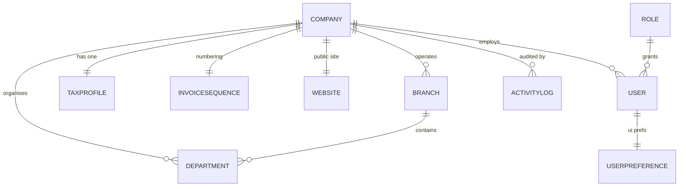
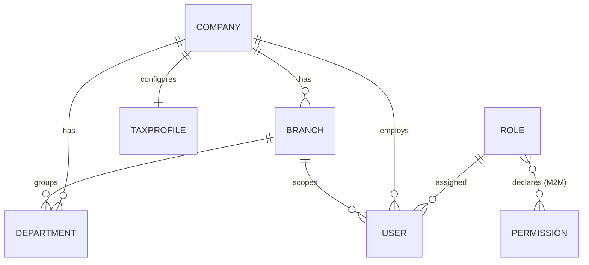
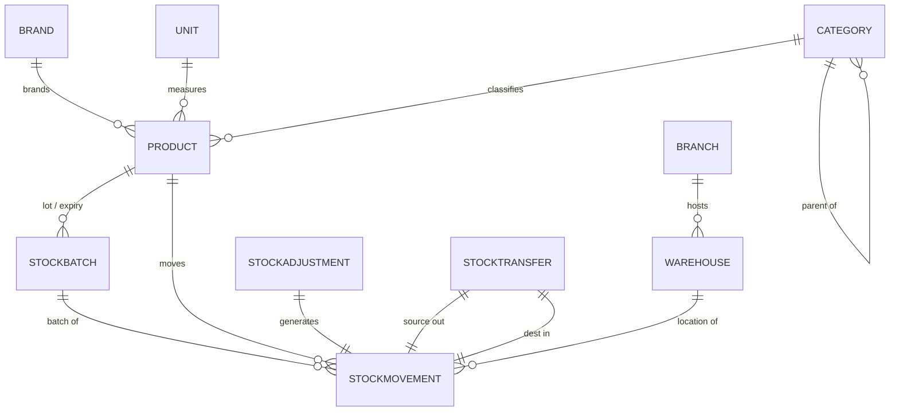
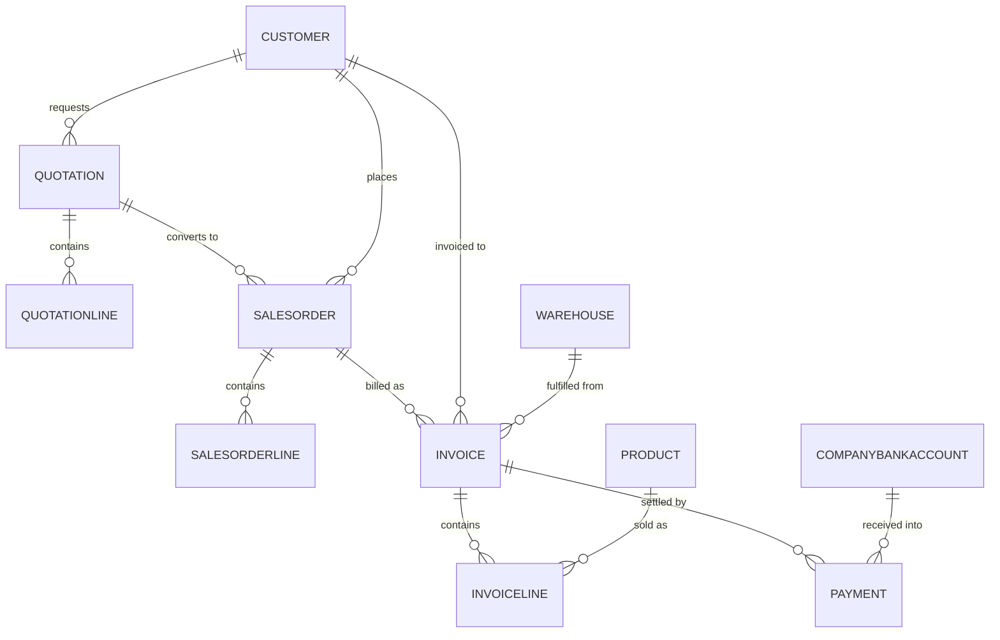
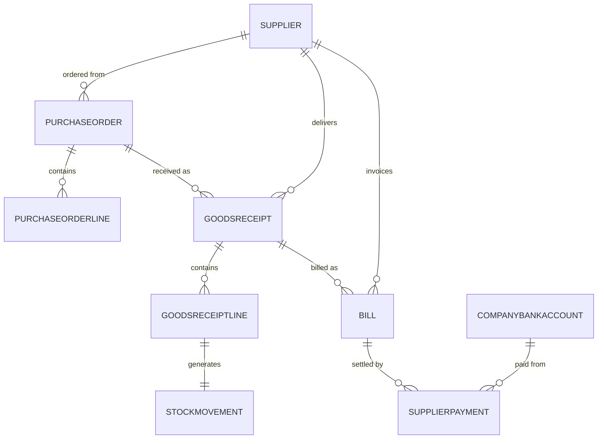
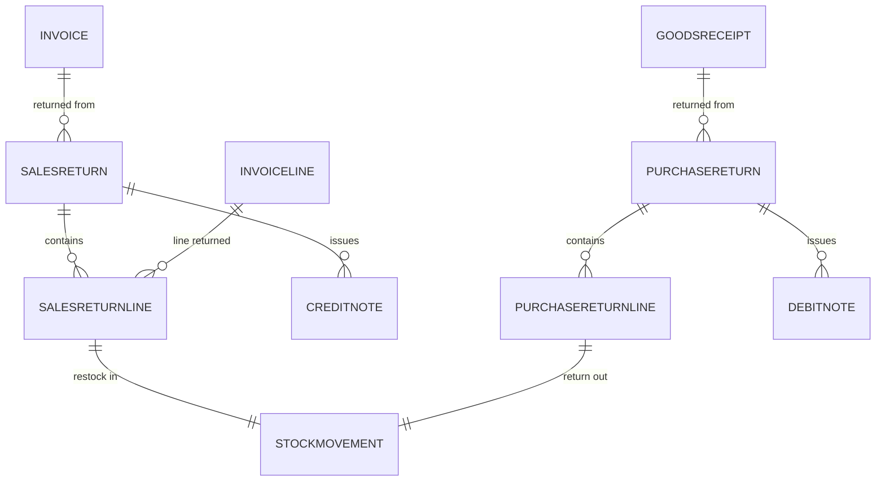
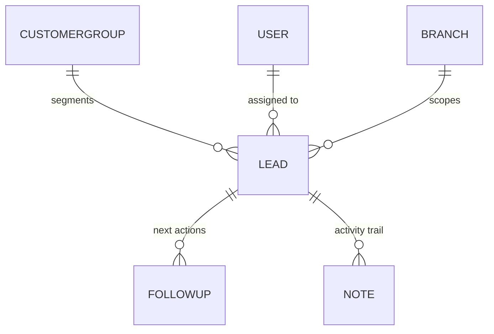
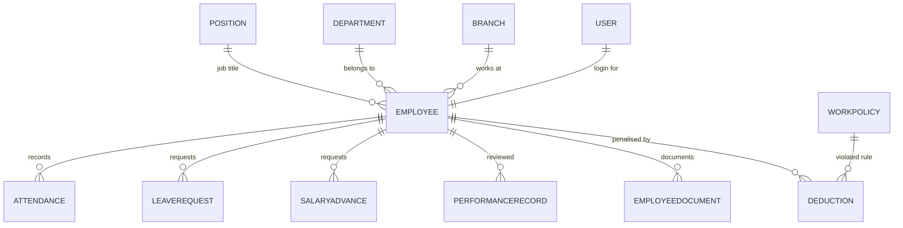
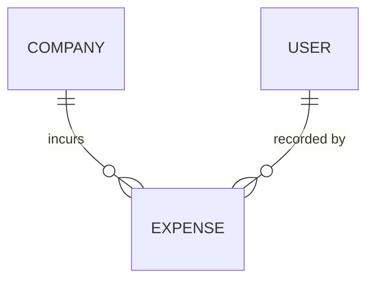
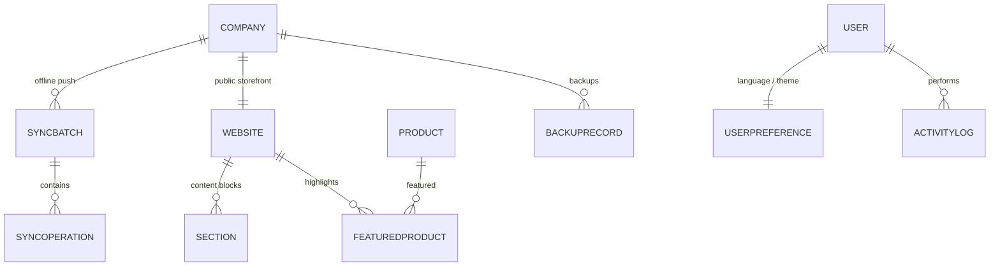

# Entity Relationship Diagram — ERP Platform

Complete data model reference: **61 models across 13 Django apps**. Generated by
introspecting the live model registry, so it reflects the schema as built.

## How to read this

- Diagrams are [Mermaid](https://mermaid.js.org/) `erDiagram` blocks — they render
  natively on GitHub and in most Markdown viewers.
- `||--o{` = one-to-many · `||--||` = one-to-one · `}o--||` = many-to-one (optional).
- The model is split by domain because one diagram of 61 entities is unreadable.
  Section 0 is the spine that ties them together.

## Cross-cutting conventions

Every domain follows the same four rules, so they aren't repeated per section:

| Convention | What it means in the schema |
|---|---|
| **Company scoping** (Rule #1) | Almost every table carries a direct `company` FK. No endpoint returns cross-company rows; the FK is forced from the request user, never the payload. |
| **Branch scoping** | Tables with a physical/organisational dimension also carry `branch` (`Warehouse`, `Invoice`, `Quotation`, `SalesOrder`, `PurchaseOrder`, `Lead`, `Employee`). Branch-scoped roles see own-branch + unassigned rows. |
| **Append-only ledgers** (Rule #9) | `StockMovement`, `Payment`, `Invoice`, returns and `ActivityLog` are never edited in place — corrections are new offsetting rows. |
| **Audit trail** (Rule #8) | Every state-changing action writes an `ActivityLog` row (who / what / when / before→after). |

## 0. The tenancy spine

`Company` is the tenant root — nearly every table hangs off it. `User` is the actor
on almost every write.

## 1. Identity & Organisation (`accounts`, `org`)

Roles are a **fixed seeded set**; permissions are resolved from the
`ROLE_MODULE_MATRIX` in `core/rbac.py` keyed by role *name*, not from the
`Permission` table (which exists but is not the live authorisation source).
`Role.scope_level` (`platform` / `business` / `branch`) decides data breadth.

| Entity | Purpose | Key links |
|---|---|---|
| `Company` | Tenant root | — |
| `Branch` | Physical location | → Company |
| `Department` | Org unit | → Company, Branch |
| `TaxProfile` | Jurisdiction config (Rule #7) | 1–1 Company |
| `User` | Login identity (email-based) | → Company, Branch, Role |
| `Role` | Named role + `scope_level` | ↔ Permission (M2M) |
| `Permission` | Permission catalogue | — |

## 2. Inventory (`inventory`)

`StockMovement` is the **single source of truth for stock** — on-hand is always
derived by summing movements, never stored. Adjustments and transfers each
generate their movement(s) via a one-to-one link, so every quantity change is
traceable to its cause.

| Entity | Notes |
|---|---|
| `Product` | sku, barcode, prices, `reorder_level`, `track_batches` → Category, Brand, Unit |
| `Warehouse` | Stock location → Company, Branch |
| `StockBatch` | lot number + expiry → Product |
| `StockMovement` | **Typed ledger**: `sale_out`, `purchase_in`, `adjustment`, `transfer`, `sales_return_in`, `purchase_return_out` |
| `StockAdjustment` | Manual correction, 1–1 → StockMovement |
| `StockTransfer` | Between warehouses, 1–1 → two StockMovements |

## 3. Sales (`sales`)

The quote → order → invoice chain is optional at each step (an invoice can be
raised directly at POS). Payments are **manually recorded only** (Rule #3) — no
gateway. `InvoiceSequence` guarantees gapless per-company numbering.

| Entity | Notes |
|---|---|
| `Customer` | AR balance derived from invoices, never stored |
| `Invoice` / `InvoiceLine` | Append-only; line → Product |
| `Payment` | method (cash/bank_transfer), bank ref last-4, `verified_at`/`verified_by` |
| `CompanyBankAccount` | The company's receiving account |
| `InvoiceSequence` | 1–1 Company; gapless counter |

## 4. Purchasing (`purchasing`)

Mirrors sales in reverse. Receiving stock is what creates `purchase_in`
movements — each `GoodsReceiptLine` owns exactly one `StockMovement`.

## 5. Returns (`returns`)

Enforces Rules #4–6: a return line **must** reference the original document line,
returned stock never silently re-enters sellable inventory (explicit
disposition), and every return produces a formal Credit/Debit Note.

`SalesReturnLine.disposition` ∈ `quarantine` (default) · `restocked` · `scrapped`
— only `restocked` posts a `sales_return_in` movement.

## 6. CRM (`crm`)

`Lead.stage` ∈ `new` · `contacted` · `qualified` · `proposal` · `won` · `lost`
(`won`/`lost` are the closed stages excluded from the open pipeline).

## 7. HR (`hr`)

| Entity | Notes |
|---|---|
| `Position` | Job title + `base_salary` |
| `Employee` | Optional 1–1 to a `User` login |
| `LeaveRequest` | typed (`annual`/`casual`/`unpaid`/`sick`/`other`) + optional `medical_report` file; pending→approved/rejected |
| `SalaryAdvance` | amount + reason, same approval workflow |
| `WorkPolicy` | rule + `violation_type` (misconduct/absence/tardiness/other) |
| `Deduction` | salary penalty → Employee + the WorkPolicy breached + recording user |

## 8. Finance (`finance`)

Deliberately **no parallel revenue ledger** — revenue is derived from sales
`Invoice` totals so there is one source of truth. Only expenses are stored.

`Expense`: category, description, amount, method (cash/bank_transfer), date.
Net funds = derived invoice revenue − recorded expenses.

## 9. Platform services (`sync`, `website`, `ops`, `core`)

| Entity | Notes |
|---|---|
| `SyncBatch` / `SyncOperation` | Offline queue replay; idempotent at batch and op level (Rule #2) |
| `Website` / `Section` / `FeaturedProduct` | Auto-provisioned per-company public site |
| `BackupRecord` | Backup metadata + optional off-site `storage_key` |
| `UserPreference` | 1–1 User; language + theme |
| `ActivityLog` | Audit trail: user, action, entity_type/id, IP, `metadata.changes` (before→after), timestamp |

## Entity index

| App | Models |
|---|---|
| `accounts` (3) | Permission, Role, User |
| `org` (4) | Company, Branch, Department, TaxProfile |
| `inventory` (9) | Category, Brand, Unit, Warehouse, Product, StockBatch, StockMovement, StockAdjustment, StockTransfer |
| `sales` (10) | Customer, CompanyBankAccount, InvoiceSequence, Quotation, QuotationLine, SalesOrder, SalesOrderLine, Invoice, InvoiceLine, Payment |
| `purchasing` (7) | Supplier, PurchaseOrder, PurchaseOrderLine, GoodsReceipt, GoodsReceiptLine, Bill, SupplierPayment |
| `returns` (6) | SalesReturn, SalesReturnLine, PurchaseReturn, PurchaseReturnLine, CreditNote, DebitNote |
| `crm` (4) | CustomerGroup, Lead, FollowUp, Note |
| `hr` (9) | Position, Employee, Attendance, LeaveRequest, PerformanceRecord, EmployeeDocument, SalaryAdvance, WorkPolicy, Deduction |
| `finance` (1) | Expense |
| `sync` (2) | SyncBatch, SyncOperation |
| `website` (3) | Website, Section, FeaturedProduct |
| `ops` (2) | BackupRecord, UserPreference |
| `core` (1) | ActivityLog |
| `tax` (0) | No models — pluggable handlers only, config lives on `org.TaxProfile` |

**Total: 61 models.**
